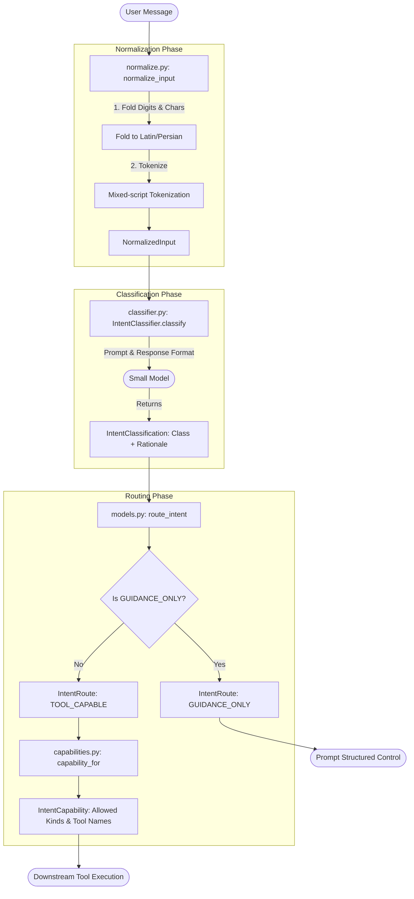
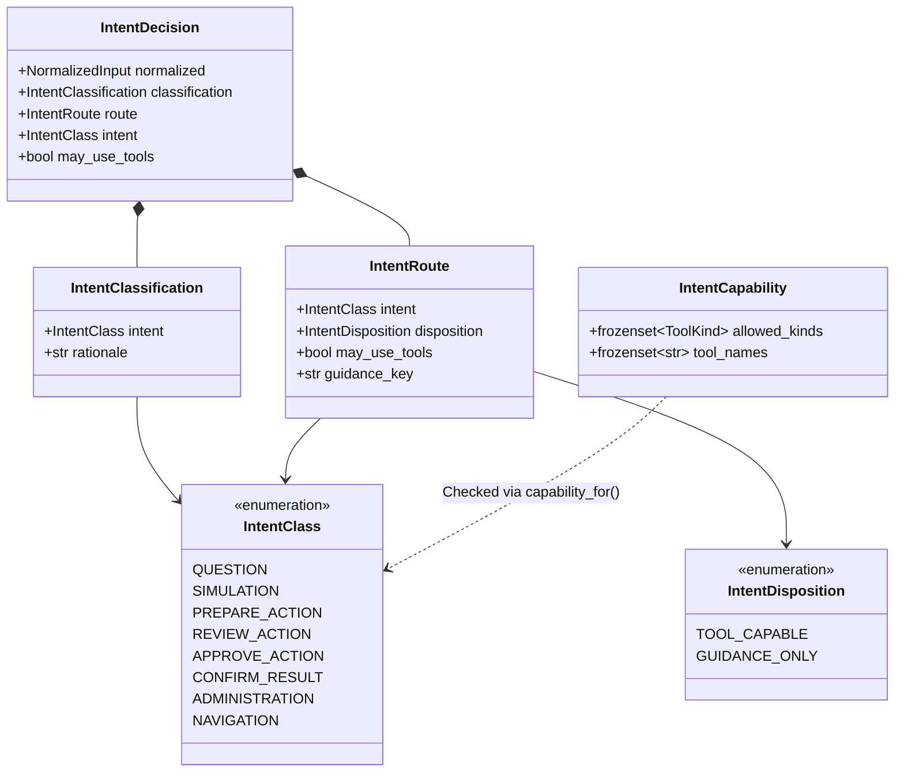
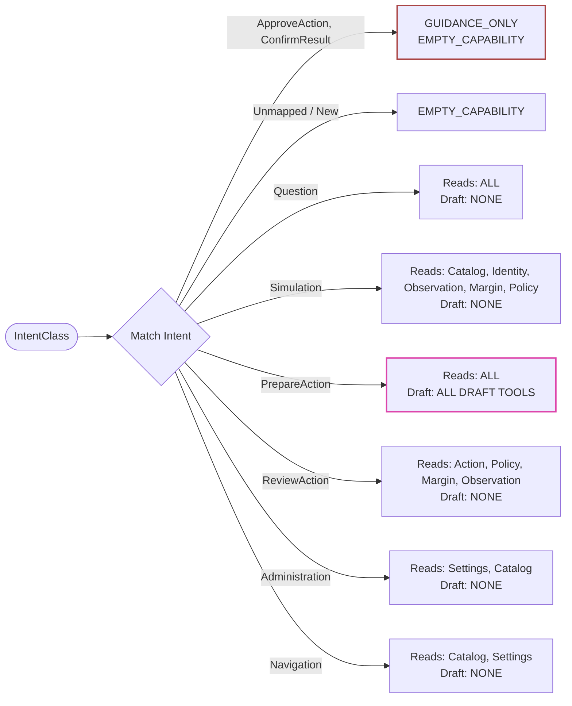

# Intent Classification and Routing

This module (`llm.intents`) handles the classification of marketplace-operator messages into intents and deterministically routes them to their allowed capabilities. It acts as the critical boundary where unstructured text is categorized, and rules about what the AI can and cannot do are enforced independently of the model's judgment.

## Objectives
- **Classification**: A small model categorizes each conversation turn into exactly one of eight explicit P0 intent classes (`Question`, `Simulation`, `PrepareAction`, `ReviewAction`, `ApproveAction`, `ConfirmResult`, `Administration`, `Navigation`).
- **Deterministic Routing**: Once categorized, routing an intent to a disposition is a pure, deterministic function. The LLM never decides whether a tool may run.
- **Structural Containment**: Free text can never approve or confirm actions. `ApproveAction` and `ConfirmResult` intents are structurally `GUIDANCE_ONLY`, meaning they never invoke tools. They instead direct the user to a structured control outside the model plane.

## How It Works & Data Flow

1. **Normalization (`normalize.py`)**
   Before classification, the raw input undergoes pure, idempotent normalization:
   - **Digit Folding**: Persian (`U+06F0..U+06F9`) and Arabic-Indic (`U+0660..U+0669`) digits are folded to Latin `0-9`.
   - **Character Folding**: Arabic presentation variants (like Arabic Kaf/Yeh) are mapped to their Persian equivalents to ensure identical tokenization for shorthand typed on either keyboard.
   - **Tokenization**: The text is split into mixed-script tokens, preserving Zero-Width Non-Joiners (ZWNJ) so compound Persian words remain intact.
   *Note: This step only canonicalizes glyphs; it never infers meaning or resolves ambiguity.*

2. **Classification (`classifier.py`)**
   - The canonicalized text is sent to the `IntentClassifier`. 
   - A small model evaluates the text against a strict system prompt and returns a typed `IntentClassification` (using structured output / `response_format`), containing the chosen `IntentClass` and a short rationale.
   - The classifier step is restricted from binding any tools (`tools=[]`), ensuring classification itself cannot trigger side effects.
   - If the model fails to return a structured classification within a strict recursion limit, it fails closed (raises `ValueError`) rather than guessing.
   - *In DEV/CI*: A deterministic, content-sensitive `keyword_mock.py` classifier is used to prove that specific phrasing routes correctly to guidance-only behaviors, utilizing a broad lexicon of approval and confirmation keywords in English, Persian, and mixed shorthand.

3. **Routing (`models.py`)**
   - The classified `IntentClass` is passed to a pure `route_intent` function.
   - `route_intent` determines the `IntentDisposition` (`TOOL_CAPABLE` or `GUIDANCE_ONLY`) and resolves whether the intent may use tools based on predefined constraints.

4. **Capabilities Allocation (`capabilities.py`)**
   - For `TOOL_CAPABLE` intents, explicit capabilities are checked via an `IntentCapability` definition, which dictates the allowed tool kinds (`READ`, `DRAFT`) and the exact tool names available to that intent.
   - This prevents read-only intents from accidentally executing Draft actions.

## Constraints & Invariants

- **Model is Decoupled from Authority**: The LLM classifying the intent has zero authority over tool execution. Its only job is to categorize the text.
- **Fail-Closed Capabilities**: By default, intents have `EMPTY_CAPABILITY` (nothing granted). New or unmapped intents resolve to this empty capability.
- **Strict Draft Isolation**: `PrepareAction` is the ONLY intent class granted Draft authority (`ToolKind.DRAFT`). Other classes that can read data cannot create Drafts.
- **Guidance-Only Isolation**: `ApproveAction` and `ConfirmResult` resolve to `EMPTY_CAPABILITY` and have a `GUIDANCE_ONLY` disposition. They are inherently blocked from running any tools and produce guidance text to prompt the operator to use structured UI controls.
- **No Ambiguity Resolution in Normalization**: Normalization canonicalizes raw input to resolve visual identity issues across Persian/Arabic keyboards, but never guesses the meaning of technical identifiers.

## Architecture & Data Flow Diagrams

### 1. Intent Classification Pipeline (Flowchart)
This flowchart shows the lifecycle of a user message as it goes through normalization, classification by the LLM, and deterministic routing.

### 2. Core Models and Data Structures (Class Diagram)
This diagram illustrates the core data structures passed between the pipeline stages and how they relate.

### 3. Capabilities and Disposition Routing (Decision Tree)
This decision tree shows how `capabilities.py` restricts access. `PrepareAction` is the only intent allowed to perform Drafts, while `ApproveAction` and `ConfirmResult` are strictly walled off from any tool access.

