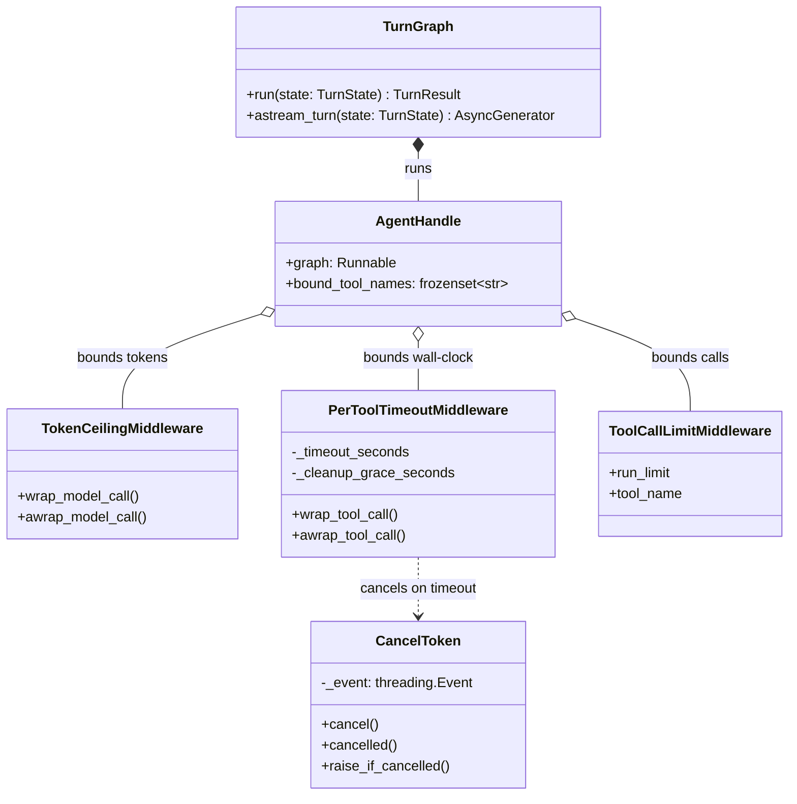

# LLM Orchestrator

This module provides the core conversation turn orchestration and leaf agent execution for the DK Marketplace Intelligence service. It leverages LangGraph for the top-level turn workflow and LangChain for leaf agent interaction.

## Objectives
- **Single-Source Tool Execution**: Bind tools exclusively from a shared `ToolRegistry` to ensure all actions use approved integrations.
- **Top-Level Orchestration**: Use a LangGraph `StateGraph` to manage the complete lifecycle of a conversational turn, from intent classification to agent execution.
- **Strict Execution Constraints**: Enforce hard boundaries around agent execution, including timeouts, tool call limits, and token limits, ensuring the system fails closed rather than producing unbounded or silently truncated outputs.
- **Deterministic Containment**: Provide a single gate to classify intent and contain unauthorized attempts (e.g., stopping approval or confirmation commands from executing against tools).
- **Dual Path Execution**: Support both buffered (synchronous invoke) and streamed (asynchronous token-by-token) request paths using the exact same constraints and failure mappings.

## How It Works

### Orchestration (`graph.py`)
The conversation turn is modeled as a `TurnGraph`. The graph state (`TurnState`) strictly uses JSON-safe data types (no framework types or agents) because there is no durable checkpointer. The graph implements a single node workflow:
1. **Classification and Containment**: Before any agent or tool runs, the message's intent is classified. 
   - Unclassifiable intents immediately yield a structured failure.
   - Approval/confirmation attempts yield a guidance response and immediately short-circuit.
2. **Agent Execution**: If the intent is tool-capable, the message is routed to the leaf agent.
3. **Structured Mapping**: Exceptions and timeouts are caught and deterministically mapped to structured `TurnFailure` objects.

### Leaf Agents (`agent.py`)
Leaf agents are constructed using LangChain's `create_agent`. They act strictly as explainers and drafters; they never make decisions or confirm actions. The agent binds only a specified subset of tools from the `ToolRegistry` and outputs a strongly-typed `AssistantAnswer`.

Middlewares wrap the agent's execution to enforce limits:
- `ToolCallLimitMiddleware`: Enforces limits globally and per-tool.
- `PerToolTimeoutMiddleware`: Enforces strict wall-clock limits on tool execution, working alongside request-scoped cancellation.
- `TokenCeilingMiddleware`: Fails closed when the language model hits a max output token limit.

### Cooperative Cancellation (`cancellation.py`)
A `CancelToken` is passed via `contextvars` to bound tool execution. Because Python threads cannot be forcefully killed, this cooperative token ensures that outbound tool transports (e.g., network reads/writes) can check for cancellation (`current_cancel_token()`) and fail closed at their own network seams when deadlines elapse.

## Data Flow
1. **Input**: A `TurnState` dictionary containing the user's `message`, `marketplace_account_id`, and `conversation_id`.
2. **Containment Gate**: The `TurnGraph` runs `_classify_and_contain()`.
3. **Agent Loop**: The request enters `_run_agent` (buffered) or `_astream_agent` (streaming). The agent interacts with the LLM, making tool calls as necessary.
4. **Tool Execution**: Tools run within individual bounded contexts. If a timeout happens, the context's `CancelToken` is cancelled.
5. **LLM Output**: The agent outputs a structured `AssistantAnswer`.
6. **Serialization**: `envelope_from_structured` serializes the structured response into a JSON-safe dictionary (preserving precision for fields like `Money`).
7. **Output**: The orchestration returns a `TurnResult` with either an `answer` dict or a structured `failure`. In streaming mode, chunks of text (`token`) are yielded incrementally, followed by a final `final` or `failure` chunk.

## Constraints & Error Handling
The orchestrator heavily relies on failing closed for safety:
- **Graph Recursion**: A `GraphRecursionError` maps to a `TURN_RECURSION_LIMIT` failure if the agent takes too many steps.
- **Tool Call Limits**: Exceeding global or per-tool call limits maps to a `TOOL_CALL_LIMIT` failure.
- **Tool Timeouts**: Timeouts map to a `TOOL_TIMEOUT` failure and trigger cooperative cancellation to abort outbound network connections.
- **Token Ceilings**: A provider returning `finish_reason == "length"` triggers a `TokenCeilingError` and maps to a `TOKEN_CEILING` failure to prevent silent output truncation.
- **Transient Provider Errors**: Transient failures are retried exactly once. In streaming mode, retries only occur if no token has been emitted to the client yet; otherwise, the stream fails closed immediately.
- **Non-Retryable Errors**: Validation, permission, and 4xx provider errors map immediately to a `MODEL_PROVIDER_ERROR` failure without retries.

## Architecture and Flow

### Orchestration Flow
The following diagram illustrates the turn lifecycle, containment gates, and failure mappings applied in `TurnGraph` and its embedded leaf agent:

```mermaid
flowchart TD
    Start((Start)) --> Classify["Classify & Contain<br/>(_classify_and_contain)"]
    
    Classify -- Unclassifiable --> FailUnclass["Failure<br/>(INTENT_UNCLASSIFIED)"]
    Classify -- Approve/Confirm --> Guidance["Return Guidance Answer<br/>(No Agent)"]
    Classify -- Tool-Capable --> AgentNode["Agent Execution<br/>(_run_agent / _astream_agent)"]

    subgraph Agent [Leaf Agent (agent.py)]
        AgentStart((Invoke LLM)) --> Middlewares
        Middlewares -->|global / per-tool limit| FailCall["Failure<br/>(TOOL_CALL_LIMIT)"]
        Middlewares -->|timeout| FailTimeout["Failure<br/>(TOOL_TIMEOUT)"]
        Middlewares -->|finish_reason=length| FailToken["Failure<br/>(TOKEN_CEILING)"]
        Middlewares --> LLM["BaseChatModel"]
        LLM -->|Tool Call| ToolRun["Execute Tool in<br/>CancelToken context"]
        ToolRun -- cancelled --> FailTimeout
        LLM -->|Completed| FinalAnswer["AssistantAnswer"]
    end
    
    AgentNode --> Agent
    AgentNode -- Transient Error --> Retry{"First attempt?"}
    Retry -- Yes --> Agent
    Retry -- No --> FailTransient["Failure<br/>(MODEL_TRANSIENT_FAILURE)"]
    
    AgentNode -- Non-Retryable Error --> FailProvider["Failure<br/>(MODEL_PROVIDER_ERROR)"]
    AgentNode -- Max Recursion --> FailRecursion["Failure<br/>(TURN_RECURSION_LIMIT)"]

    FinalAnswer --> Serialize["envelope_from_structured"]
    
    FailUnclass --> End((End))
    Guidance --> End
    Serialize --> End
    FailCall --> End
    FailTimeout --> End
    FailToken --> End
    FailTransient --> End
    FailProvider --> End
    FailRecursion --> End
```

### Component Architecture
This class diagram highlights the relationships between the orchestrator, agent middleware, and cooperative cancellation mechanisms:


