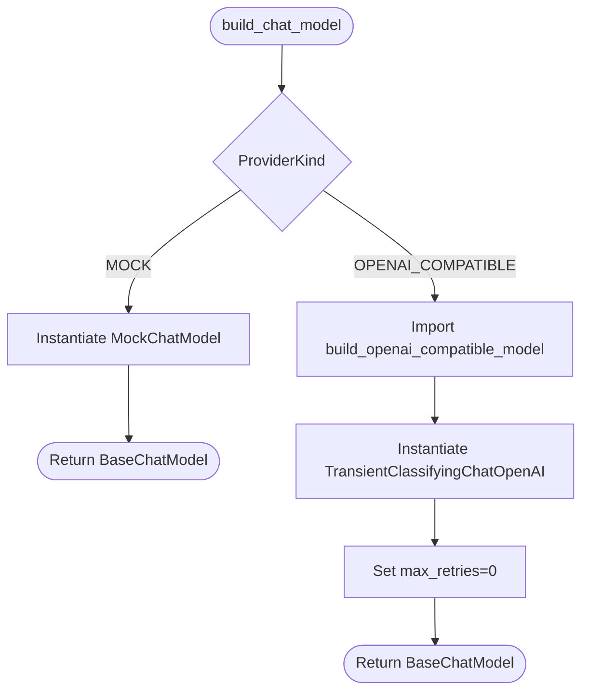
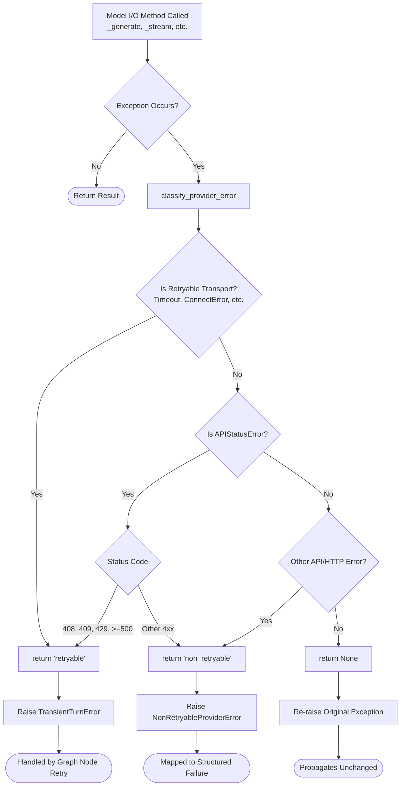
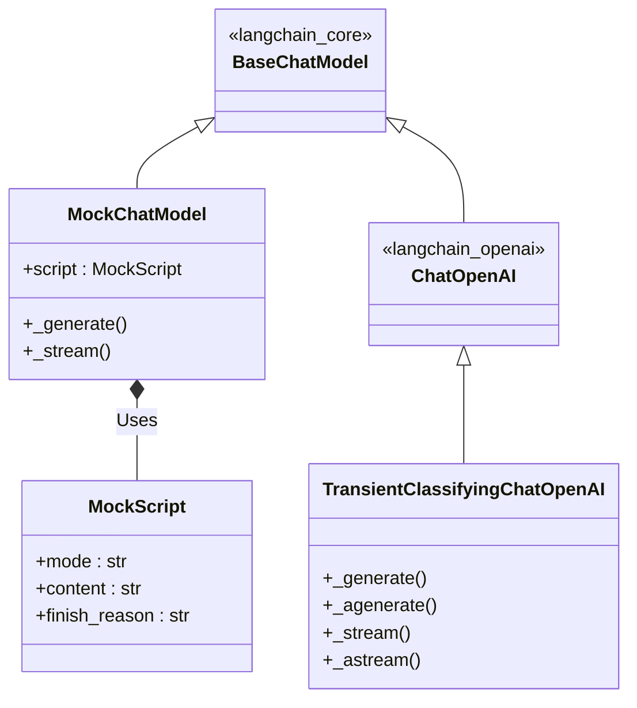

# LLM Providers Module

This module implements the single, owned OpenAI-compatible transport port for the `market-ops` LLM service, as required by PRD §12.1.

## Objectives

1. **Single Transport Port**: Provide one uniform port (`build_chat_model`) that returns a LangChain `BaseChatModel`.
2. **Environment Separation**: Support both a deterministic, in-process mock for tests/CI (no paid calls) and a production OpenAI-compatible endpoint.
3. **No Vendor Branches**: Ensure all providers are assumed OpenAI-compatible. There are no vendor-specific SDK branches.
4. **Controlled Retry Policy**: Disable the hidden SDK retry loops so that the graph node remains the sole retry authority (§12.4).
5. **Failure Normalization**: Intercept and translate raw provider and transport failures into an owned, explicitly classified taxonomy at the model boundaries.

## How it Works & Data Flow

- **Entry Point (`base.py`)**: `build_chat_model` dispatches based on the configured `ProviderKind`.
  - For `MOCK`, it returns a `MockChatModel` instance.
  - For `OPENAI_COMPATIBLE`, it lazily imports and invokes `build_openai_compatible_model` from `openai_compatible.py`. The lazy import guarantees that tests and CI pipelines never load or wire `langchain-openai` unintentionally.
- **Production Transport (`openai_compatible.py`)**: `build_openai_compatible_model` constructs a `TransientClassifyingChatOpenAI` instance, which is a thin wrapper over `langchain_openai.ChatOpenAI`. 
  - This wrapper overrides the four fundamental I/O methods (`_generate`, `_agenerate`, `_stream`, `_astream`).
  - When exceptions occur, they are caught and passed through `_reclassify` to convert raw `openai` or `httpx` exceptions into owned domain errors.
- **Error Classification (`transient.py`)**: Contains the taxonomy logic for failure classification:
  - `TransientTurnError`: Covers explicit retryable transport failures (timeouts, connection resets, rate limits, 5xx). These are eligible for the single graph node retry.
  - `NonRetryableProviderError`: Covers non-retryable provider failures (auth, permission, not-found, other 4xx). These map to the structured `MODEL_PROVIDER_ERROR` and are never retried.
- **Mock Transport (`mock.py`)**: Implements `MockChatModel` and `MockScript` for testing. The mock faithfully adheres to the LangChain `BaseChatModel` contract, generating deterministic, scripted responses (structured answers, natural language streams, or forced tool loops) without making network calls.

## Constraints

- **Strictly OpenAI-Compatible**: The module must never include logic specific to any single vendor SDK. Every provider must expose an OpenAI-compatible API.
- **No Hidden Retries**: `max_retries=0` is strictly enforced for the `ChatOpenAI` instance. The wrapper adapter only classifies and re-raises exceptions; it **never** retries on its own and **never** swallows errors into plausible defaults (must fail closed).
- **Test Purity**: The deterministic mock must be used for all tests and CI paths to ensure zero paid model calls (§12.5).
- **Token Ceiling Guard**: If a completion is truncated due to a token limit, the provider must surface the exact finish reason (e.g., `finish_reason="length"`). This guard must fail closed without silent truncation, which is accurately simulated in `MockChatModel` during tests.

## Architecture Diagrams

### Initialization Flow

### Error Classification Flow (Transport Wrapping)

### Class Hierarchy

