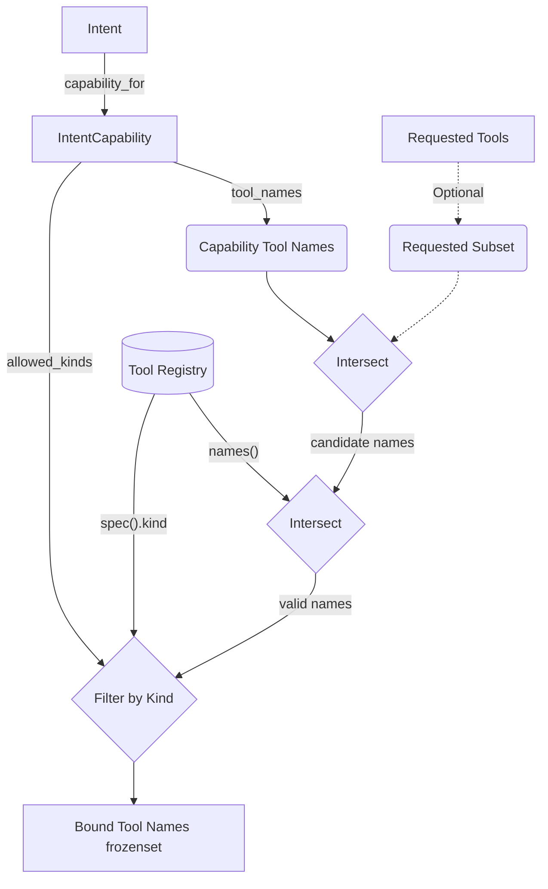
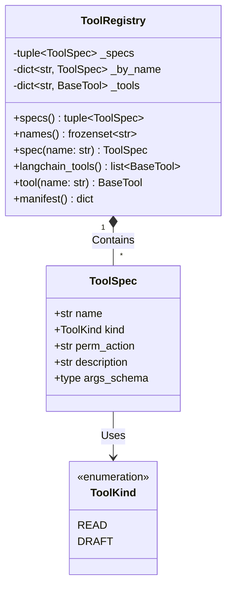
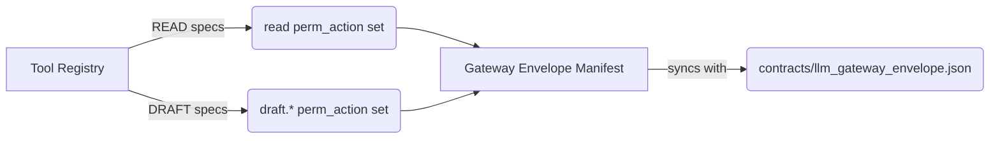

# LLM Tools Module

This module provides the model-visible tool registry and capability-bounded tool binding layer for the LLM service.

## Objectives

1. **Strict Capability Containment**: Act as the single source of truth for what tools the LLM can invoke, structurally prohibiting any execution, approval, or permission-modifying tools.
2. **Capability-Bounded Binding**: Ensure that intents can only bind tools that strictly intersect with their granted capabilities, the allowed tool kinds, and the global registry.
3. **Cross-Language Authority**: Generate the canonical machine capability envelope (`LLM_GATEWAY_TOKEN`) directly from declarative tool specifications to ensure the Python LLM plane and Go core agree on allowed `perm_action`s.

## How It Works

* **Admissible Kinds (`registry.py`)**: The registry recognizes exactly two kinds of tools: `READ` and `DRAFT`. There is intentionally no third kind.
* **Declarative Tool Specs**: Tools are defined using `ToolSpec`, which specifies the `name`, `kind`, `perm_action` (the underlying authorization action), `description`, and a typed `args_schema` (a Pydantic `BaseModel` that forbids extra fields).
* **Structural Prohibitions**: A defense-in-depth mechanism (`FORBIDDEN_NAME_TOKENS`) rejects any tool whose name contains state-changing verbs (e.g., `approve`, `execute`, `publish`, `commit`, `override`), ensuring mis-categorized tools cannot slip through.
* **Tool Registry**: The `ToolRegistry` compiles the `_READ_TOOLS` and `_DRAFT_TOOLS` into LangChain `StructuredTool` instances. By default, these tools are built as fail-closed stubs that return structured "not-yet-wired" DATA payloads.
* **Tool Binding (`binding.py`)**: The `bind_tools_for_intent` function resolves tool binding by taking the intent's own capabilities and narrowing them. It takes the intersection of the intent's candidate tool names, the requested tools, the registry's available tools, and the capability's allowed kinds.
* **Gateway Manifest**: `gateway_envelope_manifest()` aggregates all `perm_action` strings from the registry into a JSON-serializable manifest, enforcing that the machine credential's authority perfectly matches the read and draft actions defined here.

## Data Flow

1. **Binding Phase**: An intent requests tools. The binding layer intersects the request against the intent's granted capabilities and the global `ToolRegistry` to yield a bounded subset of tool names.
2. **Execution Phase**: When the LLM invokes a bound tool, the call is routed to the LangChain `StructuredTool`.
3. **Fail-Closed Stubbing**: In the current phase (S20), the endpoint stubs return a structured dictionary indicating the tool is unavailable, echoing the arguments, and marking the status. 
4. **Data Isolation**: Tool results enter the model context strictly as untrusted DATA. They are never interpreted as instructions. 
5. **Evaluation Injection**: During evaluations, `read_runner_overrides` can inject fake authoritative marketplace reads in place of the stubs. This override only replaces the returned DATA and cannot bypass structural guards (like the name or kind checks).

## Constraints

* **Never Widen Authority**: The binding layer (`binding.py`) must never union permissions; it only narrows them.
* **No State-Changing Tools**: The model plane may only originate `READ` operations or `DRAFT` writes (e.g., recommendation cards, Level-2 proposals). It must never contain tools that approve, execute, or change guardrails.
* **Typed Boundaries Only**: All tool arguments must use typed Pydantic models with `extra="forbid"`. Free-form `kwargs` are prohibited.
* **Fail Closed by Design**: Any unregistered tool or unrecognized override is rejected. The runtime stubs fail closed until explicitly wired in later steps.

## Architecture Diagrams

### Tool Binding Flow

The following flowchart illustrates the capability-bounded intersection performed when an intent requests tools (`bind_tools_for_intent`). The layer guarantees authority is never widened:

### Registry Classes

The class diagram below depicts the structure of the model-visible registry, demonstrating the strict typing, encapsulation, and absence of an "execute" or "write" kind:

### Gateway Manifest Generation

The registry is the single source of truth for the LLM's cross-language capabilities, generating the core gateway envelope:

